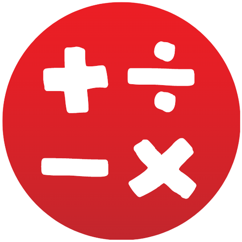
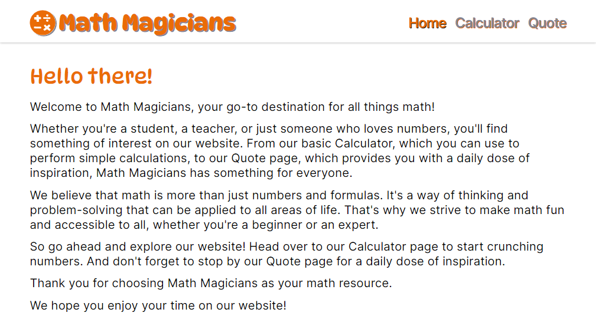
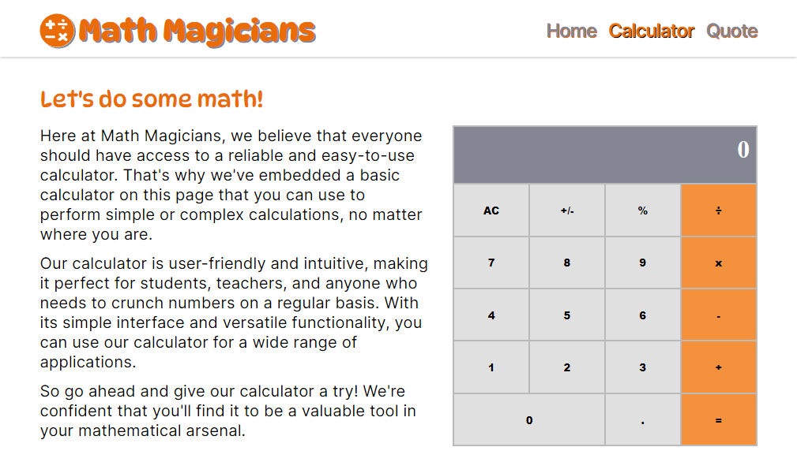
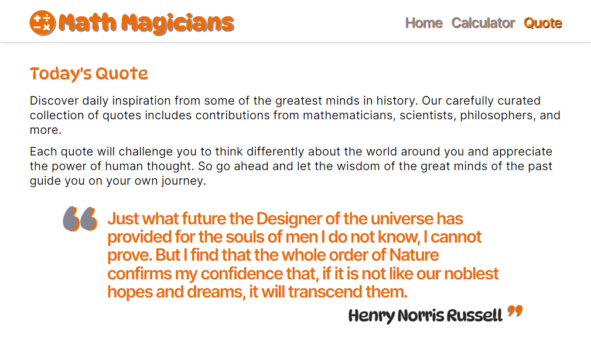
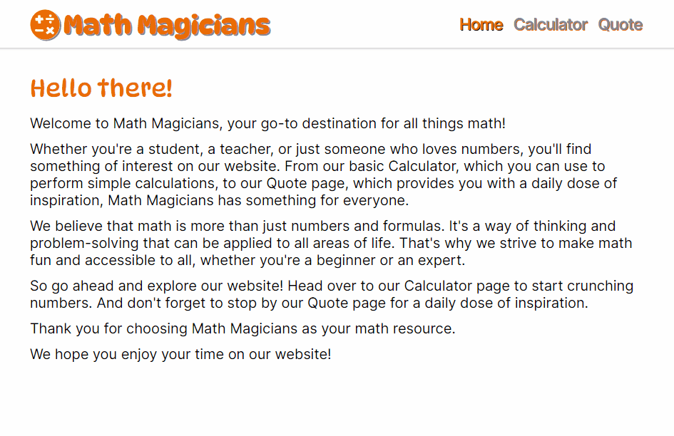

<a name="readme-top"></a>

<div align="center">

  
  <br/>

### Math Magicians
"Math magicians" is a website for all fans of mathematics. It is a Single Page App (SPA) that allows users to:<br>
1> Make simple calculations, and<br>2> Read a random inspirational quote.<br />
I'm building this application to learn how to use React.

</div>

# 📗 Table of Contents

- [📗 Table of Contents](#-table-of-contents)
- [📖 \[Math Magicians\] ](#-math-magicians-)
    - [Screenshots of how the App looks.](#below-you-can-see-how-the-app-looks)
    - [Watch a demo of the App working.](#below-you-can-see-how-the-app-is-working)
  - [🛠 Built With ](#-built-with-)
    - [Tech Stack ](#tech-stack-)
    - [Key Features ](#key-features-)
  <!-- - [� Live Demo ](#-live-demo-) -->
  - [💻 Getting Started ](#-getting-started-)
    - [Prerequisites](#prerequisites)
    - [Setup](#setup)
    - [Available Scripts](#available-scripts)
  - [👥 Authors ](#-authors-)
  - [🔭 Future Features ](#-future-features-)
  - [🤝 Contributing ](#-contributing-)
  - [🙏 Acknowledgments ](#-acknowledgments-)
  - [⭐ Show your support ](#-show-your-support-)
  - [📝 License ](#-license-)

# 📖 [Math Magicians] <a name="about-project"></a>

*[Math Magicians]* is a website for all fans of mathematics. It is a Single Page App (SPA) that allows users to:
- Make simple calculations.
- Read a random inspirational quote.

By building this application, I'm learning how to use React.


<div align="center">

### Below you can see how the App looks.

<p>
  <sup>It has a <b>Home Page</b> that gives the Welcome to its visitors.</sup><br>
  
</p>
<p>
  <sup>a <b>Calculator Page</b> where you can play with the Calculator embeded.</sup><br>
  <br>
  <sup>It has a fully functional <b>Calculator</b> to do basic aritmethic operations.</sup>
</p>
<p>
  <sup>And also a <b>Quote Page</b> that shows a Daily Quote to get some inspiration.</sup><br>
  
</p>

### Below you can see how the App is working.

<p>
  <sup>This is a live demo of the Full Math Magicians Site working.</sup><br>
  
</p>

</div>

## 🛠 Built With <a name="built-with"></a>

### Tech Stack <a name="tech-stack"></a>
This project was bootstrapped with:
  <ul>
    <li>
      <a href="https://react.dev/" target="_blank" rel="noopener noreferrer">
       React</a>
    </li>
    <li>
      <a href="https://create-react-app.dev/" target="_blank" rel="noopener noreferrer">
       Create React App</a>
    </li>
  </ul>


### Key Features <a name="key-features"></a>

- *Single Page App (SPA), with three Pages Home, Calculator and Quotes.*
- *A fully functional Calculator embeded in the Calculator Page.*
- *DOM manipulation.*
- *It renders a Math Quote randomly.*

<p align="right">(<a href="#readme-top">back to top</a>)</p>

<!--
## 🚀 Live Demo <a name="live-demo"></a>

- <a href="https://mv-math-magicians.onrender.com/" target="_blank" rel="noopener noreferrer">Math Magicians - Live Demo</a>


<p align="right">(<a href="#readme-top">back to top</a>)</p>
-->

## 💻 Getting Started <a name="getting-started"></a>

To get a local copy up and running, follow these steps.

### Prerequisites

 - In order to run this project locally you need `git` installed. Please got to [Getting Started - Installing Git guide](https://git-scm.com/book/en/v2/Getting-Started-Installing-Git) and follow the steps described for your system to install `git`.

 - You must have Node installed on our machine to access the NPM (Node Package Manager) tool.
  Run `node -v` and `npm -v` in the terminal to see if you have node and npm installed, respectively. Ensure you have node>=14.0.0 and npm>=5.6\
  If you don’t have them installed, head to [Node](https://nodejs.org/) to download and install the latest stable version.


### Setup

Clone this repository to your desired folder:
```sh
  cd my-folder
  git clone git@github.com:luigirazum/mv-mathmagicians-app.git
```

### Install

Install project dependencies with:
```sh
  cd mv-mathmagicians-app
  npm install
```

### Available Scripts

- #### Run
    In the project directory, you can run:

    ```sh
      npm start
    ```

  - Runs the app in the development mode.
    - Open [http://localhost:3000](http://localhost:3000) to view it in your browser.
  - The page will reload when you make changes.
  - You may also see any lint errors in the console.

- #### Test
    ```sh
      npm test
    ```

   - Launches the test runner in the interactive watch mode.\
      See the section about [running tests](https://facebook.github.io/create-react-app/docs/running-tests) for more information.

- #### Build
    ```sh
      npm run build
    ```

  - Builds the app for production to the `build` folder.
    - It correctly bundles React in production mode and optimizes the build for the best performance.
  - The build is minified and the filenames include the hashes.
  - Your app is ready to be deployed!\
    See the section about [deployment](https://facebook.github.io/create-react-app/docs/deployment) for more information.

<!--
### Deployment

You can deploy this project using:
```sh
  npm deploy
```
-->
<p align="right">(<a href="#readme-top">back to top</a>)</p>


## 👥 Authors <a name="authors"></a>

👨‍💻 Luis Zubia

- GitHub: <a href="https://github.com/luigirazum" target="_blank" rel="noopener noreferrer">@luigirazum</a>
- Twitter: <a href="https://twitter.com/LuigiRazum" target="_blank" rel="noopener noreferrer">@LuigiRazum</a>
- LinkedIn: <a href="https://linkedin.com/in/luiszubia" target="_blank" rel="noopener noreferrer">Luis Zubia</a>

<p align="right">(<a href="#readme-top">back to top</a>)</p>


## 🔭 Future Features <a name="future-features"></a>

- [ ] *Add a Math Challenges page to have some fun.*
- [ ] *Add effects to the Calculator buttons, so you can see when they are pressed.*

<p align="right">(<a href="#readme-top">back to top</a>)</p>


## 🤝 Contributing <a name="contributing"></a>

In order to improve this project, contributions, issues, and feature requests are welcome!

Feel free to check the [issues page](../../issues/).


<p align="right">(<a href="#readme-top">back to top</a>)</p>


## 🙏 Acknowledgments <a name="acknowledgments"></a>
- 👏 I would like to thank the support of my partners, it is good to know that they are always willing to help.

<p align="right">(<a href="#readme-top">back to top</a>)</p>


## ⭐ Show your support <a name="support"></a>

I really enjoyed making this project, so, if you like it, I appreciate your support giving a ⭐.


<p align="right">(<a href="#readme-top">back to top</a>)</p>

<!--
## ❓ FAQ <a name="faq"></a>

- *Why should you use this project?*

  - Because you can realize what you can achieve using this amazing tool.

- *Why did I make this project?*

  - In order to start putting in practice the use of WebPack, JS ES6 modules and API's.


<p align="right">(<a href="#readme-top">back to top</a>)</p>
-->

## 📝 License <a name="license"></a>

This project is [MIT](./LICENSE) licensed.

<p align="right">(<a href="#readme-top">back to top</a>)</p>
